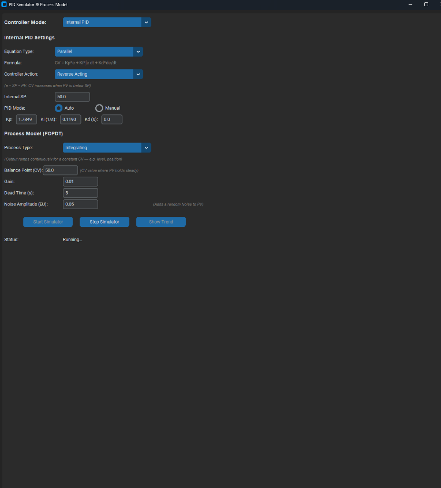
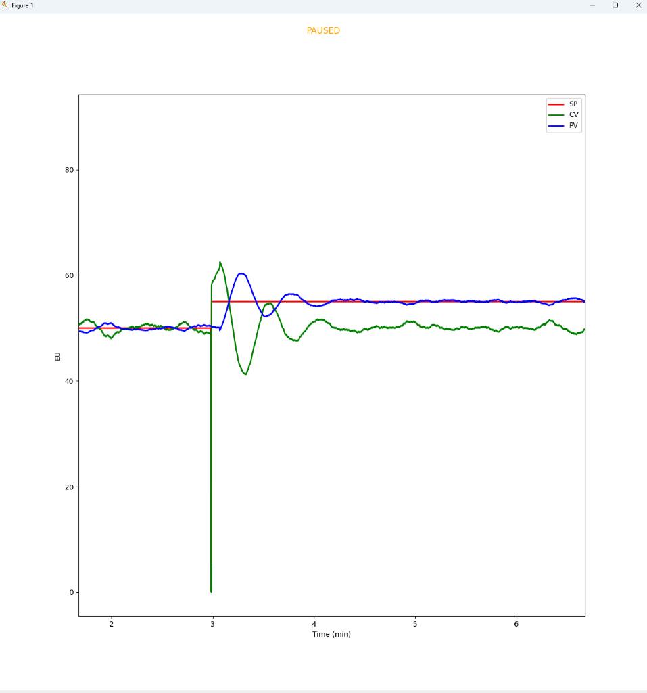

# PID Simulator & Process Model

A desktop PID simulator with a built-in FOPDT process model, supporting multiple industrial communication protocols and an internal software PID controller. Built with Python and CustomTkinter.

---

## GUI Interface



The GUI automatically adapts when switching modes — irrelevant fields are hidden, labels change to match the selected protocol, and default values are pre-filled.

---

## Features

### Communication Modes

| Mode | Description |
|---|---|
| **PyLogix** | Read/write tags to Allen-Bradley PLCs via EtherNet/IP |
| **Modbus TCP** | Communicate with Modbus TCP devices using holding registers with configurable scaling factors |
| **OPC UA** | Connect to OPC UA servers using node IDs |
| **Internal PID** | Standalone software PID controller — no external hardware required |

**Context-aware GUI behavior per mode:**

- **PyLogix**: Shows IP Address, Slot, and PLC Tag fields
- **Modbus**: Shows IP Address (default: `127.0.0.1`), Port (default: `502`), Register fields, and Scaling Factors
- **OPC UA**: Shows Server URL (default: `opc.tcp://localhost:4840`) and Node ID fields — Slot is hidden
- **Internal PID**: Hides all communication and tag fields — shows PID tuning controls and Auto/Manual toggle

### Internal PID Controller

- **Three equation types**: Parallel, Series, and PIDE (Velocity)
- **Controller action**: Reverse Acting or Direct Acting
- **Anti-windup**: Output clamping with integral back-calculation
- **Auto/Manual mode**: Toggle with radio buttons
  - **Auto**: PID calculates CV from SP and PV
  - **Manual**: User directly enters CV (%) to observe open-loop process response
  - **Bumpless transfer**: Switching from Manual → Auto seeds the PID to avoid output bumps
  - Tuning parameters (Kp, Ki, Kd) remain visible in both modes

### Process Model (FOPDT)

| Parameter | Self-Regulating | Integrating |
|---|---|---|
| **Gain** | ✅ | ✅ |
| **Dead Time** | ✅ | ✅ |
| **Noise Amplitude** | ✅ | ✅ |
| **Time Constant** | ✅ | Hidden |
| **Bias** | ✅ | Hidden |
| **Balance Point (CV)** | Hidden | ✅ |

- **Self-Regulating**: Output settles to steady-state for a constant CV (e.g., temperature, pressure)
- **Integrating**: Output ramps continuously — direction reverses around the Balance Point (e.g., level, position)
- **Non-negative constraint**: Process value (PV) is clamped to ≥ 0.0

---

## Live Trend



Real-time plotting of SP (red), PV (blue), and CV (green) with a rolling 5-minute window.

### Interactive Cursor

Move your mouse over the trend to activate the interactive cursor:

- **Crosshair** — Gray dashed crosshair snaps to the nearest data point in time
- **Snap Dots** — Colored dots appear on each line (🔴 SP, 🔵 PV, 🟢 CV) at the exact data point
- **Value Tooltip** — A dark tooltip displays the precise time and values:
  ```
  Time: 00:03:15
  SP:     55.00
  PV:     53.12
  CV:     48.67
  ```
- The tooltip automatically flips to the left side when the cursor is near the right edge

### Keyboard Shortcuts

| Key | Action |
|---|---|
| `Spacebar` | **Pause / Resume** the trend update. Title changes to "PAUSED" (orange) when paused. Data continues to record in the background. |
| `← Left Arrow` | **Scroll backward** in time. Disengages auto-follow. Title shows "Scrolling ◀" (blue). Press multiple times to scroll further back. |
| `→ Right Arrow` | **Scroll forward** in time. Title shows "Scrolling ▶" (blue). When you reach the latest data, auto-follow re-engages automatically. |
| `Home` | **Jump to live** — immediately returns to auto-follow mode showing the latest data. |
| `End` | **Jump to beginning** — scrolls to the earliest recorded data. |

### Mouse Controls

| Mouse Action | Effect |
|---|---|
| **Scroll Up** | **Zoom in** — narrows the visible time window (minimum: 30 seconds) |
| **Scroll Down** | **Zoom out** — widens the visible time window (maximum: 60 minutes) |
| **Hover** | Shows crosshair, snap dots, and value tooltip |

### Trend Status Indicator

The title bar of the trend window shows the current state:

| Title | Meaning |
|---|---|
| `Live Data` | Auto-following the latest data in real time |
| `PAUSED` | Trend updates are paused (spacebar) |
| `Scrolling ◀` | Viewing historical data (scrolled backward) |
| `Scrolling ▶` | Scrolling forward toward live data |

---

## Project Structure

```
PytonPIDSIm/
├── PythonCLX_PIDSimulator.pyw   # Main application (GUI + process model + scan loop)
├── pid_controller.py            # Internal PID controller class
├── comms_manager.py             # Communication backends (PyLogix, Modbus, OPC UA, Internal)
├── images/                      # Screenshots for documentation
├── tests/
│   └── test_pid_simulator.py    # Unit tests (38 tests)
├── requirements.txt             # Python dependencies
├── LICENSE                      # MIT License
└── .gitignore
```

---

## Installation

```bash
# Clone the repository
git clone https://github.com/Destination2Unknown/PythonCLX_PIDSimulator.git
cd PythonCLX_PIDSimulator

# Install dependencies
pip install -r requirements.txt
```

### Dependencies

| Package | Purpose |
|---|---|
| `customtkinter` | Modern GUI framework |
| `numpy` | Numerical computation |
| `matplotlib` | Live trend plotting |
| `scipy` | ODE solver for process model |
| `pylogix` | Allen-Bradley PLC communication |
| `pymodbus` | Modbus TCP communication |
| `asyncua` | OPC UA client |

---

## Usage

### Launch the Simulator

```bash
python PythonCLX_PIDSimulator.pyw
```

### Quick Start (Internal PID — no hardware needed)

1. Select **Internal PID** from the Controller Mode dropdown
2. Set PID tuning: `Kp=1.0`, `Ki=0.1`, `Kd=0.0`
3. Set Internal SP to `50.0`
4. Click **Start Simulator**
5. The trend window opens automatically — watch the PV track the SP

### Open-Loop Step Test

1. Select **Internal PID** → switch PID Mode to **Manual**
2. Set Manual CV to `0.0`, click **Start Simulator**
3. Change Manual CV to `50.0` to step the output
4. Observe the open-loop process response on the trend
5. Use `Spacebar` to pause, then mouse over the trend to inspect exact values
6. Switch back to **Auto** for bumpless transfer to closed-loop

### Navigating the Trend

1. Press `Spacebar` to pause the trend
2. Use `← Left Arrow` and `→ Right Arrow` to scroll through the history
3. Use `Mouse Scroll` to zoom in/out on the time axis
4. Press `Home` to jump back to live data
5. Hover over the trend to see exact SP, PV, CV values with colored snap dots

### External PLC Mode

1. Select **PyLogix**, **Modbus**, or **OPC UA**
2. Enter the device IP/URL, Slot/Port, and tag names or register addresses
3. Click **Start Simulator**
4. The simulator reads SP and CV from the PLC/device and writes PV back

---

## Running Tests

```bash
python -m pytest tests/test_pid_simulator.py -v
```

All **38 tests** cover:
- PID controller (Parallel, Series, PIDE equations)
- Controller action (Reverse, Direct)
- Anti-windup clamping and back-calculation
- FOPDT model (Self-Regulating and Integrating)
- Balance point behavior
- Communication result objects

---

## How It Works

```
┌─────────────┐     CV      ┌──────────────┐     PV
│  PID         │──────────►│  FOPDT Model   │──────────►
│  Controller  │◄──────────│  (+ Dead Time) │
│  (or PLC)   │     PV      │  (+ Noise)     │
└─────────────┘             └──────────────┘
       ▲
       │ SP (setpoint)
```

- **Scan rate**: 100ms (10 scans/second)
- **Dead time**: Implemented via CV history buffer
- **ODE solver**: `scipy.integrate.odeint`
- **Thread safety**: Dedicated scan thread with lock; GUI updates via `StringVar.set()`

---

## License

MIT License — see [LICENSE](LICENSE) for details.
